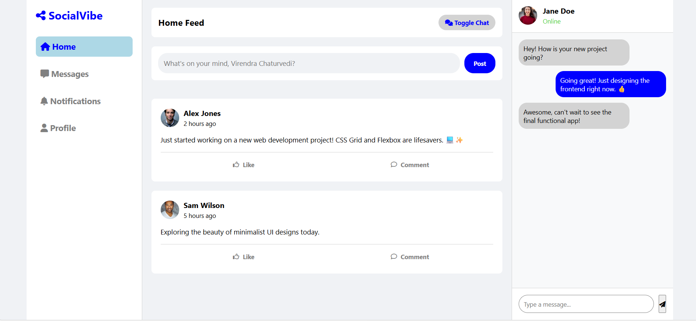
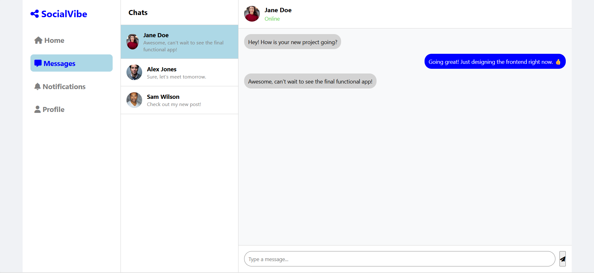
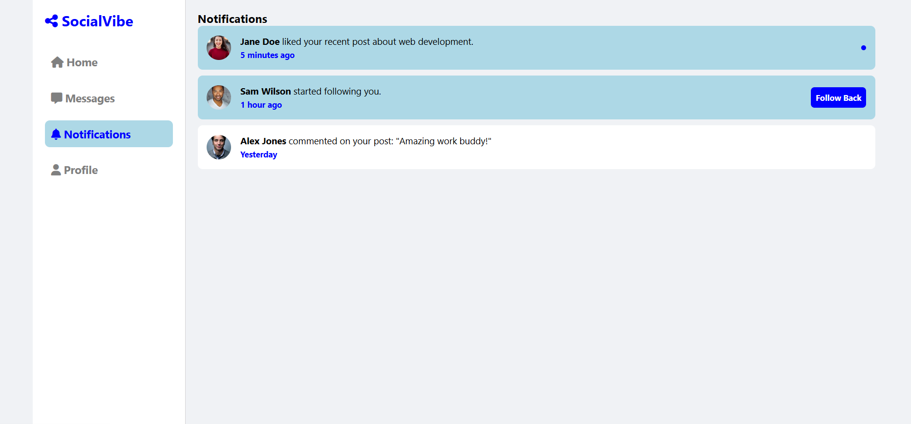
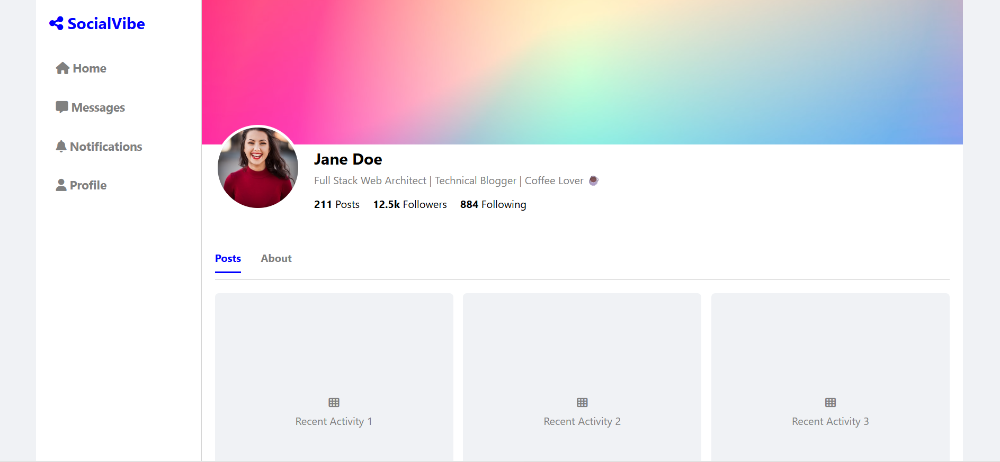
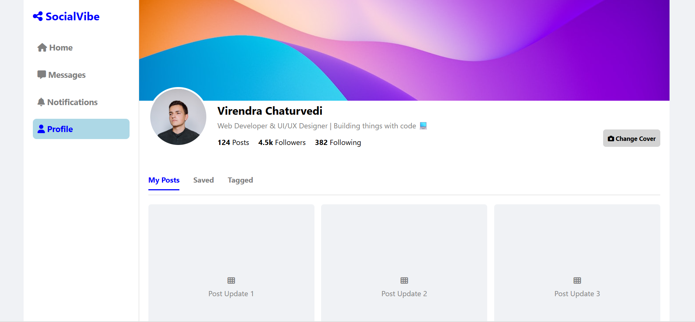

# 🚀 SocialVibe - Social Media Dashboard

Completed an interactive Social Media Dashboard as part of the **CodeAlpha** internship program (Task 3)! 

This frontend project is a responsive dashboard built completely from scratch using pure Vanilla JavaScript and CSS, without using any external frameworks.

---

## 🛠️ Key Highlights & Features

* 🧠 **State Management:** Handled runtime states using `sessionStorage` so likes, comments, and messages stay persistent when navigating across different pages.
* 💬 **Interactive Inbox:** Real-time chat simulation with multiple user threads.
* 📸 **Profile Uploads:** Integrated JS `FileReader` to dynamically update avatars and cover photos.
* 🎨 **Clean UI:** Responsive layouts with custom tab switching.

The focus of this task was to strengthen core JavaScript DOM manipulation and master client-side storage architecture.

---

## 📸 Project Screenshots (Output)

---

## 🔗 Links

* **Live Demo:** [https://virendra-chaturvedi.github.io/SocialVibe/]
* **LinkedIn Video Walkthrough:** [https://www.linkedin.com/posts/virendra-chaturvedi-085a9822a_codealpha-codealpha-webdevelopment-ugcPost-7470885696711520256-WeCX/?utm_source=share&utm_medium=member_desktop&rcm=ACoAADl4J2UBKIIBdlbDxlKwupmv1mT6J-vKKeA] 
